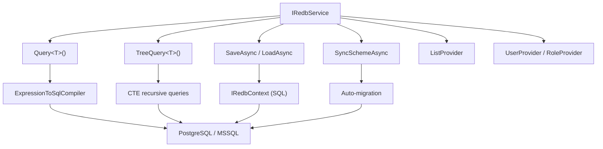

# RedBase — Data Platform for .NET

**SQL speed. NoSQL flexibility. Pure C# schemas. Zero migrations.**

RedBase is a data platform for .NET that stores typed objects in a relational backend (PostgreSQL, Microsoft SQL Server). You define schemas as plain C# classes — RedBase handles storage, indexing, querying, trees, lists, aggregation, and window functions through a single LINQ-style API.

No Entity Framework. No migrations. No 40-table Include chains. Just C# classes and one line to save, one line to load.

[](https://www.nuget.org/packages/redb.Core)
[](https://www.nuget.org/packages/redb.Core)
[](LICENSE)
[](https://dotnet.microsoft.com)
[](https://redbase.app)
[](https://redb.ru)

---

## Why RedBase

| Problem | EF Core / Dapper | RedBase |
|---------|------------------|---------|
| 28 related tables | 40+ Include/ThenInclude, 200 lines of config | `LoadAsync<T>(id)` — 1 line, full object graph |
| Add a field | Create migration, update DbContext, deploy | Add property to C# class, done |
| Tree structures | Manual recursive CTEs, no reusable API | Built-in `TreeQuery<T>()` with CTE, depth, ancestors |
| Dynamic schema | Pain. EF doesn't support it | Native. Schema = C# class. `SyncSchemeAsync()` |
| Learn curve | DbContext, Fluent API, migrations, conventions | One interface: `IRedbService`. One attribute: `[RedbScheme]` |
| Forgot Include? | Runtime crash or silent null | Impossible — Props are always loaded |

---

## Quick Start

```csharp
// 1. Define a schema — that's your "migration"
[RedbScheme("Employee")]
public class EmployeeProps
{
    public string FirstName { get; set; } = "";
    public string LastName { get; set; } = "";
    public int Age { get; set; }
    public decimal Salary { get; set; }
    public string Department { get; set; } = "";
    public string Position { get; set; } = "";
    public DateTime HireDate { get; set; }
    public string[]? Skills { get; set; }
    public Address? HomeAddress { get; set; }
    public Dictionary<int, decimal>? BonusByYear { get; set; }
}

// 2. Sync scheme (creates storage automatically)
await redb.SyncSchemeAsync<EmployeeProps>();

// 3. Save — from E001_SaveAsync.cs
var employee = new RedbObject<EmployeeProps>
{
    name = "New Developer",
    Props = new EmployeeProps
    {
        FirstName = "Alice",
        LastName = "Johnson",
        Age = 28,
        Position = "Developer",
        Department = "Engineering",
        Salary = 85000m,
        HireDate = DateTime.Today,
        Skills = ["C#", "React", "SQL"]
    }
};
await redb.SaveAsync(employee);

// 4. Load — from E002_LoadAsync.cs
var loaded = await redb.LoadAsync<EmployeeProps>(employee.Id);
// loaded.Props.FirstName → "Alice"

// 5. Query — from E010_WhereSimple.cs
var results = await redb.Query<EmployeeProps>()
    .Where(e => e.Salary > 75000m)
    .OrderByDescending(e => e.Salary)
    .Take(100)
    .ToListAsync();

// 6. Projection — from E075_Select.cs
var projected = await redb.Query<EmployeeProps>()
    .Select(x => new { x.Props.FirstName, x.Props.LastName, x.Props.Salary })
    .ToListAsync();
```

### Create from Template

```bash
dotnet new install redb.Templates
dotnet new redb -n MyProject --provider postgres
cd MyProject
dotnet run
```

---

## Packages

| Package | NuGet | Description |
|---------|-------|-------------|
| `redb.Core` | [](https://www.nuget.org/packages/redb.Core) | Core abstractions, query builder, LINQ provider |
| `redb.Postgres` | [](https://www.nuget.org/packages/redb.Postgres) | PostgreSQL provider (free, MIT) |
| `redb.MSSql` | [](https://www.nuget.org/packages/redb.MSSql) | Microsoft SQL Server provider (free, MIT) |
| `redb.Core.Pro` | [](https://www.nuget.org/packages/redb.Core.Pro) | Pro extensions: parallel materialization, change tracking, migrations |
| `redb.Postgres.Pro` | [](https://www.nuget.org/packages/redb.Postgres.Pro) | PostgreSQL Pro provider with optimized query generation |
| `redb.MSSql.Pro` | [](https://www.nuget.org/packages/redb.MSSql.Pro) | MSSQL Pro provider with optimized query generation |
| `redb.Export` | [](https://www.nuget.org/packages/redb.Export) | Database export/import: `.redb` files (JSONL/ZIP) for backup, migration between PostgreSQL ↔ MSSQL |

---

## Installation

```bash
# PostgreSQL (Free)
dotnet add package redb.Postgres

# or MSSQL (Free)
dotnet add package redb.MSSql

# Pro — includes redb.Core.Pro automatically
dotnet add package redb.Postgres.Pro   # or redb.MSSql.Pro
```

Each provider package pulls in `redb.Core` (or `redb.Core.Pro`) as a transitive dependency.

### Setup & InitializeAsync

```csharp
using redb.Core;
using redb.Core.Extensions;
using redb.Postgres.Pro.Extensions;  // or redb.MSSql.Pro.Extensions

var builder = WebApplication.CreateBuilder(args);

// Register REDB Pro
builder.Services.AddRedbPro(options => options
    .UsePostgres("Host=localhost;Database=mydb;Username=postgres;Password=pass")
    // .UseMsSql("Server=localhost;Database=mydb;User Id=sa;Password=pass;TrustServerCertificate=true")
    .WithLicense("YOUR-LICENSE-KEY")     // optional — trial works without it
    .Configure(c =>
    {
        c.EavSaveStrategy = EavSaveStrategy.ChangeTracking;
        c.EnableLazyLoadingForProps = false;
        c.EnablePropsCache = true;
    }));

var app = builder.Build();

// Initialize and sync schemes
var redb = app.Services.GetRequiredService<IRedbService>();
await redb.InitializeAsync();
await redb.SyncSchemeAsync<EmployeeProps>();
```

**Free version** — same pattern, just `AddRedb` instead of `AddRedbPro`, no license:

```csharp
using redb.Core.Extensions;
using redb.Postgres.Extensions;  // or redb.MSSql.Extensions

builder.Services.AddRedb(options => options
    .UsePostgres("Host=localhost;Database=mydb;Username=postgres;Password=pass"));
```

### Database Setup Options

REDB provides several ways to create the database schema:

**Option A — Automatic on startup (recommended):**

```csharp
// Creates schema if missing, then initializes
await redb.InitializeAsync(ensureCreated: true);
```

**Option B — Explicit call:**

```csharp
await redb.EnsureDatabaseAsync(); // idempotent — safe to call every time
await redb.InitializeAsync();
```

**Option C — Export SQL script for DBA / CI:**

```csharp
var sql = redb.GetSchemaScript();
File.WriteAllText("redb_schema.sql", sql);
```

**Option D — CLI tool:**

```bash
dotnet tool install --global redb.CLI

# Create schema in an existing database
redb init --connection "Host=localhost;Database=mydb;..." --provider postgres

# Export SQL to file
redb schema --provider postgres --output redb_schema.sql
```

---

## Capabilities

### CRUD

| Feature | API | Notes |
|---------|-----|-------|
| Save single object | `SaveAsync(obj)` | Create or update |
| Load by ID | `LoadAsync<T>(id)` | Returns `RedbObject<T>` with Props |
| Bulk insert | `AddNewObjectsAsync(objects)` | Single round-trip via COPY protocol, replaces thousands of INSERTs |
| Batch save | `SaveAsync(IEnumerable<IRedbObject>)` | Save multiple objects at once |
| Delete | `DeleteAsync(id)`, `DeleteWithPurgeAsync(ids)` | Single or batch delete with full purge |
| Load-modify-save | `LoadAsync` → modify → `SaveAsync` | Standard update pattern |

### Object Graph (RedbObject References in Props)

Props can contain `RedbObject<T>` properties — single, array, or dictionary. The entire graph is saved and loaded in one call. No JOINs, no Include chains, no manual assembly.

```csharp
// Real model from redb.Examples/Models/ExampleModels.cs
[RedbScheme("Employee")]
public class EmployeeProps
{
    public string FirstName { get; set; } = "";
    public int Age { get; set; }
    public decimal Salary { get; set; }

    // Nested business class (Address with nested BuildingInfo)
    public Address? HomeAddress { get; set; }

    // Array of business classes
    public Contact[]? Contacts { get; set; }

    // RedbObject reference — single
    public RedbObject<ProjectMetricsProps>? CurrentProject { get; set; }

    // RedbObject references — array
    public RedbObject<ProjectMetricsProps>[]? PastProjects { get; set; }

    // Dictionary with RedbObject values
    public Dictionary<string, RedbObject<ProjectMetricsProps>>? ProjectMetrics { get; set; }

    // Dictionary with nested classes
    public Dictionary<string, Department>? DepartmentHistory { get; set; }

    // Tuple key dictionary
    public Dictionary<(int Year, string Quarter), string>? PerformanceReviews { get; set; }
}

// Save — entire graph persisted, ParentId set automatically
await redb.SaveAsync(employee);

// Load — full graph reconstructed, all nested objects hydrated
var loaded = await redb.LoadAsync<OrderProps>(id);
// loaded.Props.Payment.Props          — ready
// loaded.Props.RelatedMetrics[0].Props — ready
// loaded.Props.Coupons["SUMMER"].Props — ready
```

Nested objects are real `RedbObject` instances with their own `id`, `name`, `DateCreate`, `DateModify`, and `Props`. They can be queried independently, updated in place, and participate in tree structures.

### Rich Props Structure

Props fields can be any combination of scalars, nested classes, collections, and dictionaries — arbitrarily deep. Everything is serialized, stored, and fully restored on load. No extra tables, no FKs, no mapping.

```csharp
[RedbScheme("Analytics Record")]
public class AnalyticsRecordProps
{
    // Scalars
    public string Title { get; set; } = "";
    public int Views { get; set; }
    public decimal Revenue { get; set; }

    // Primitive arrays
    public string[]? Tags { get; set; }
    public int[]? Scores { get; set; }

    // Nested business class
    public Address? HomeAddress { get; set; }

    // Array of business classes
    public Contact[]? Contacts { get; set; }

    // Dictionary<string, primitive>
    public Dictionary<string, string>? PhoneBook { get; set; }

    // Dictionary<int, decimal>
    public Dictionary<int, decimal>? PriceList { get; set; }

    // Dictionary<string, nested class>
    public Dictionary<string, Address>? AddressBook { get; set; }

    // Dictionary<string, complex class with its own arrays and dicts>
    public Dictionary<string, ProjectInfo>? ComplexBook { get; set; }

    // Tuple key dictionary
    public Dictionary<(int, string), string>? TupleKeyDict { get; set; }
}

public class Address
{
    public string City { get; set; } = "";
    public string Street { get; set; } = "";
    public BuildingDetails? Details { get; set; }   // nesting goes deeper
}

public class ProjectInfo
{
    public string Title { get; set; } = "";
    public int Priority { get; set; }
    public string[]? Tags { get; set; }             // arrays inside dict values
    public MetricTag[]? MetricTags { get; set; }    // class arrays inside dict values
    public Dictionary<string, int>? Scores { get; set; } // dict inside dict value
}
```

All saved and loaded with a single `SaveAsync` / `LoadAsync`. Fields can be added or removed at any time — `SyncSchemeAsync` handles it.

### Where Filters

| Feature | Example | Notes |
|---------|---------|-------|
| Comparison | `.Where(e => e.Salary > 75000)` | `>`, `<`, `>=`, `<=`, `==`, `!=` |
| AND / OR / NOT | `.Where(e => e.Age >= 30 && e.Salary > 70000)` | Standard boolean logic |
| Chained Where | `.Where(...).Where(...)` | Multiple calls = AND |
| WhereIn | `.WhereIn(e => e.Department, values)` | SQL `IN (...)` clause |
| Nullable fields | `.Where(e => e.Code == null)` | IS NULL / IS NOT NULL |
| Base field filters | `.WhereRedb(o => o.DateCreate.Year == 2025)` | Filter on `_objects` table fields directly |
| WhereInRedb | `.WhereInRedb(x => x.Id, ids)` | IN on base fields — direct |

### DateTime

| Feature | Example |
|---------|---------|
| Comparison | `.Where(e => e.HireDate >= cutoffDate)` |
| Range | `.Where(e => e.HireDate >= start && e.HireDate < end)` |
| Extract parts | `.WhereRedb(o => o.DateCreate.Year == 2025)` |

### String Operations

| Feature | Example | SQL |
|---------|---------|-----|
| Contains | `.Where(e => e.Name.Contains("Smith"))` | `LIKE '%Smith%'` |
| StartsWith | `.Where(e => e.Name.StartsWith("John"))` | `LIKE 'John%'` |
| Case-insensitive | `.Contains("smith", StringComparison.OrdinalIgnoreCase)` | `ILIKE` |
| ToLower / ToUpper | `.Where(e => e.Name.ToLower().Contains("s"))` | `LOWER()` |
| Trim + Length | `.Where(e => e.Name.Trim().Length > 3)` | `TRIM()`, `LENGTH()` |

### Nested Properties

| Feature | Example |
|---------|---------|
| Nested class field | `.Where(e => e.HomeAddress!.City == "London")` |
| Deep nesting (3+ levels) | `.Where(e => e.HomeAddress!.Building!.Floor > 10)` |

### Array Operations

| Feature | Example |
|---------|---------|
| Contains element | `.Where(e => e.Skills.Contains("C#"))` |
| Contains any (OR) | `.Where(e => e.Skills.Contains("C#") \|\| e.Skills.Contains("Python"))` |
| Contains all (AND) | `.Where(e => e.Skills.Contains("C#") && e.Skills.Contains("SQL"))` |
| Exclude element | `.Where(e => e.Skills.Contains("C#") && !e.Skills.Contains("intern"))` |
| Mixed with scalars | `.Where(e => e.Age > 30 && e.Skills.Contains("C#"))` |

### Dictionary Operations

| Feature | Example |
|---------|---------|
| ContainsKey | `.Where(e => e.PhoneDirectory!.ContainsKey("desk"))` |
| Indexer filter | `.Where(e => e.BonusByYear![2023] > 6000)` |
| Nested class in value | `.Where(e => e.Locations!["HQ"].City == "NY")` |
| Tuple key | `.Where(e => e.Reviews![reviewKey] == "Excellent")` |

### Projection & Pagination

| Feature | API | Notes |
|---------|-----|-------|
| Select fields | `.Select(x => new { x.Props.FirstName, x.Props.Salary })` | Server-side projection, fetches only selected columns |
| Distinct | `.Distinct()` | Dedup by Props hash |
| DistinctBy | `.DistinctBy(x => x.Field)`, `.DistinctByRedb(x => x.Name)` | Distinct on specific field |
| OrderBy | `.OrderBy(e => e.Salary)`, `.OrderByDescending(...)` | Ascending / descending |
| ThenBy | `.ThenBy(...)`, `.ThenByDescending(...)` | Multi-field sorting |
| Skip / Take | `.Skip(10).Take(10)` | Pagination |
| FirstOrDefault | `.FirstOrDefaultAsync()` | Single result or null |

### Existence & Count

| Feature | API |
|---------|-----|
| Count | `.CountAsync()` |
| Any | `.AnyAsync()`, `.AnyAsync(predicate)` |
| All | `.AllAsync(predicate)` |

### Arithmetic & Math

| Feature | Example | SQL |
|---------|---------|-----|
| Arithmetic in Where | `.Where(e => e.Salary * 12 > 1_000_000)` | Inline `*`, `/`, `+`, `-` |
| Multi-field formulas | `.Where(e => e.Age * 1000 + e.Salary > 120_000)` | Combined expressions |
| Math.Abs | `.Where(e => Math.Abs(e.Age - 35) <= 5)` | `ABS()` |
| Arbitrary SQL function | `Sql.Function<T>("COALESCE", e.Age, 0)` | Any SQL function by name |

### Aggregation

| Feature | API | Notes |
|---------|-----|-------|
| Sum | `.SumAsync(e => e.Salary)` | Server-side `SUM` |
| Average | `.AverageAsync(e => e.Age)` | Server-side `AVG` |
| Min / Max | `.MinAsync(e => e.Salary)`, `.MaxAsync(...)` | Server-side `MIN` / `MAX` |
| Batch aggregation | `.AggregateAsync(x => new { Agg.Sum(...), Agg.Average(...), Agg.Count() })` | Multiple aggregations in one query |
| Filtered aggregation | `.Where(...).SumAsync(...)` | Filter before aggregating |
| Base-field aggregation | `.SumRedbAsync(x => x.Id)`, `.MinRedbAsync(x => x.DateCreate)` | Aggregate on `_objects` fields — direct |
| Array element aggregation | `Agg.Sum(x.Props.SkillLevels.Select(s => s))` | Sum all array elements |

### GroupBy

| Feature | API | Notes |
|---------|-----|-------|
| Group by field | `.GroupBy(x => x.Department).SelectAsync(g => new { g.Key, Agg.Sum(g, x => x.Salary) })` | Server-side GROUP BY |
| Filter + group | `.Where(...).GroupBy(...)` | WHERE before GROUP BY |
| Composite key | `.GroupBy(x => new { x.Department, x.Position })` | Multi-field grouping |
| Group by base field | `.GroupByRedb(x => x.OwnerId)` | GROUP BY on `_objects` — direct |
| Group by array element | `.GroupByArray(e => e.Contacts!, c => c.Type)` | Expands arrays into groups |

### Window Functions

| Feature | API | Notes |
|---------|-----|-------|
| ROW_NUMBER | `Win.RowNumber()` | Rank within partition |
| RANK / DENSE_RANK | `Win.Rank()`, `Win.DenseRank()` | Ranking with/without gaps |
| Running sum | `Win.Sum(x.Props.Salary)` | Cumulative aggregation |
| LAG / LEAD | `Win.Lag(x.Props.Salary)`, `Win.Lead(...)` | Previous / next row values |
| FIRST_VALUE / LAST_VALUE | `Win.FirstValue(...)`, `Win.LastValue(...)` | Boundary values in partition |
| NTILE | `Win.Ntile(4)` | Divide into equal buckets |
| Custom frame | `.Frame(Frame.Rows(3))` | Sliding window: `ROWS BETWEEN N PRECEDING AND CURRENT ROW` |
| Partition by base field | `.PartitionByRedb(x => x.SchemeId)` | Direct, no Props join |
| Filter + window | `.Where(...).WithWindow(...)` | Pre-filter before windowing |
| GroupBy + window | `.GroupBy(...).WithWindow(...).SelectAsync(...)` | Rank aggregated groups |

### Tree Structures

Built-in hierarchical data with closure-table storage and recursive CTEs.

| Feature | API | Notes |
|---------|-----|-------|
| Create child | `CreateChildAsync(child, parent)` | Single node creation |
| Bulk create | `AddNewObjectsAsync(treeObjects)` | Batch insert with pre-assigned IDs |
| Load tree | `LoadTreeAsync<T>(root, maxDepth)` | Full hierarchy with depth limit |
| Get children | `GetChildrenAsync<T>(parent)` | Direct children only |
| Get descendants | `GetDescendantsAsync<T>(node)` | All descendants recursively |
| Path to root | `GetPathToRootAsync<T>(node)` | Breadcrumb trail |
| Move subtree | `MoveObjectAsync(node, newParent)` | Reparent node and its subtree |
| Tree LINQ queries | `TreeQuery<T>().Where(...).OrderBy(...)` | Full LINQ on tree |
| Filter roots | `.WhereRoots()` | Root nodes only |
| Filter leaves | `.WhereLeaves()` | Leaf nodes only |
| Filter by level | `.WhereLevel(2)` | Nodes at specific depth |
| Scoped subtree query | `TreeQuery<T>(rootId, maxDepth)` | Query within a subtree |
| Multiple roots | `TreeQuery<T>(parents[], maxDepth)` | Query across subtrees |
| Ancestor filter | `.WhereHasAncestor<T>(a => a.Budget > 500000)` | Filter by ancestor properties |
| Descendant filter | `.WhereHasDescendant<T>(d => d.Budget > 100000)` | Filter by descendant properties |
| Relationship check | `node.IsDescendantOfAsync(ancestor)` | Without loading tree |
| DFS / BFS traversal | `.DepthFirstTraversal()`, `.BreadthFirstTraversal()` | In-memory traversal |
| Tree materialization | `.ToTreeListAsync()`, `.ToRootListAsync()`, `.ToFlatListAsync()` | Parent chains, recursive children, or flat |
| Tree stats | `TreeCollection<T>.GetStats()` | Depth, leaf count, max width |
| Aggregation on trees | `TreeQuery<T>().GroupBy(...)`, `.WithWindow(...)` | GroupBy and window functions in tree context |

### Lists (Reference Dictionaries)

Named lookup lists with items, useful for statuses, categories, roles.

| Feature | API |
|---------|-----|
| Create list | `RedbList.Create(name, alias)` |
| Add items | `ListProvider.AddItemsAsync(list, values, aliases)` |
| Get by name | `ListProvider.GetListByNameAsync(name)` |
| Item with linked object | `RedbListItem(list, value, alias, linkedObject)` |
| Store in Props | `Props.Status = listItem` (single), `Props.Roles = listItems` (array) |
| Filter by item value | `.Where(p => p.Status!.Value == "Active")` |
| Filter by item identity | `.Where(p => p.Status == activeItem)` |
| WhereIn on item values | `.WhereIn(p => p.Status!.Value, values)` |
| Any in item array | `.Where(p => p.Roles!.Any(r => r.Value == "Admin"))` |

### Export / Import (Database Portability)

Full database export/import via `.redb` files (JSONL, optionally ZIP-compressed). Migrate between PostgreSQL and MSSQL, create backups, replicate data.

| Feature | Notes |
|---------|-------|
| Export entire DB | `ExportService` — streams all schemes, objects, values, users, roles, permissions |
| Export filtered | Export only selected schemes by ID |
| Import | `ImportService` — streaming JSONL, bulk-insert batches |
| Compression | Optional ZIP wrapping (auto-detected on import) |
| Cross-platform | Export from PostgreSQL → Import to MSSQL (and vice versa) |
| Dry run | Preview statistics without writing |
| CLI | `redb export` / `redb import` commands |

### Users, Roles & Permissions

Built-in user management with password hashing, roles, and object-level permissions. No external identity provider required.

| Feature | API | Notes |
|---------|-----|-------|
| Create user | `UserProvider.CreateUserAsync(request)` | Login, password, name, email, phone |
| Authenticate | `UserProvider.ValidateUserAsync(login, password)` | Returns `IRedbUser?`, SHA256 + salt |
| Change password | `UserProvider.ChangePasswordAsync(userId, old, new)` | Verifies old password first |
| Enable / disable | `UserProvider.EnableUserAsync(id)`, `DisableUserAsync(id)` | Soft disable |
| Search users | `UserProvider.GetUsersAsync(criteria)` | Filter by login, email, role, date range |
| Create role | `RoleProvider.CreateRoleAsync(request)` | Named role with optional description |
| Assign role | `RoleProvider.AssignUserToRoleAsync(userId, roleId)` | Many-to-many |
| Grant permission | `GrantPermissionAsync(request)` | Per-object or per-scheme, CRUD flags |
| Check permission | `CanUserSelectObject(objectId)` | Select / Insert / Update / Delete |
| Effective permissions | `GetEffectivePermissionsAsync(userId, objectId)` | Resolved from user + role inheritance |
| Security context | `SetCurrentUser(user)`, `CreateSystemContext()` | Ambient via `AsyncLocal`, disposable elevation |

```csharp
// Authenticate
var user = await redb.UserProvider.ValidateUserAsync("admin", "password123");
if (user != null)
{
    redb.SetCurrentUser(user);
    // All subsequent operations run as this user
}

// Temporary system elevation (skip permissions)
using (redb.CreateSystemContext())
{
    await redb.SaveAsync(sensitiveObject);
}
```

---

## Architecture



```
IRedbService          ← single entry point
├── Query<T>()        ← flat LINQ queries  
├── TreeQuery<T>()    ← hierarchical queries (CTE)
├── SaveAsync()       ← create / update (full object graph)
├── LoadAsync<T>()    ← load by ID (with all nested objects)
├── ListProvider      ← reference dictionaries
├── UserProvider      ← users, authentication, passwords
├── RoleProvider      ← roles and user-role assignments
├── SecurityContext   ← current user, permission checks
└── SyncSchemeAsync() ← auto-migration from C# class
```

Storage is provider-based. Each `[RedbScheme]` class maps to an internal structure in the target database. Schema changes (new fields, removed fields, type changes) are handled automatically by `SyncSchemeAsync` — no migration files needed.

**Supported backends:** PostgreSQL 14+, Microsoft SQL Server 2019+.

---

## How It Compares

### vs Entity Framework Core

```csharp
// EF Core — 28 related entities
var order = await context.Orders
    .Include(o => o.Customer)
    .Include(o => o.Items).ThenInclude(i => i.Product).ThenInclude(p => p.Category)
    .Include(o => o.Items).ThenInclude(i => i.Discounts)
    .Include(o => o.Shipping).ThenInclude(s => s.Address)
    .Include(o => o.Payment).ThenInclude(p => p.Transactions)
    // ... 35 more Include lines ...
    .FirstOrDefaultAsync(o => o.Id == orderId);

// RedBase — same data
var order = await redb.LoadAsync<OrderProps>(orderId);
// All nested objects, arrays, dictionaries — loaded automatically.
```

### vs MongoDB / JSONB

| Aspect | MongoDB/CosmosDB | RedBase |
|--------|------------------|---------|
| Type safety | `dynamic`, `BsonDocument` | `RedbObject<T>` — full IntelliSense |
| LINQ support | Partial | Full (Where, GroupBy, Window, Aggregation) |
| Transactions | Limited | Full ACID |
| Referential integrity | None | Built-in |
| Vendor lock-in | Yes | No (PostgreSQL / MSSQL) |

---

## Pro

REDB Pro unlocks compiled query execution, parallel materialization, deep nested property queries, arithmetic and math expressions in WHERE, `Sql.Function<T>()` for calling arbitrary SQL functions, change tracking, schema migrations, and advanced analytics (window functions over grouped data). If performance matters — use Pro.

**[redbase.app/pricing](https://redbase.app/pricing)**

---

## Documentation

| Resource | Link |
|----------|------|
| Website & Docs (EN) | [redbase.app](https://redbase.app) |
| Website & Docs (RU) | [redb.ru](https://redb.ru) |
| API Reference | [redbase-app.github.io/redb](https://redbase-app.github.io/redb/) |
| Architecture | [redbase.app/architecture](https://redbase.app/architecture) |
| Quick Start | [redbase.app/quickstart](https://redbase.app/quickstart) |
| Pricing | [redbase.app/pricing](https://redbase.app/pricing) |
| Changelog | [CHANGELOG.md](CHANGELOG.md) |
| NuGet | [nuget.org/packages/redb.Core](https://www.nuget.org/packages/redb.Core) |

---

## License

Core packages (`redb.Core`, `redb.Postgres`, `redb.MSSql`, `redb.Export`) are MIT-licensed.
Pro packages require a commercial license — see [LICENSE-PRO.txt](LICENSE-PRO.txt).
